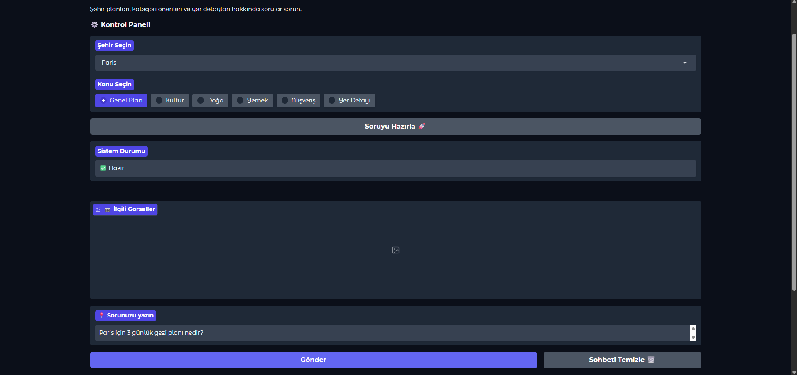
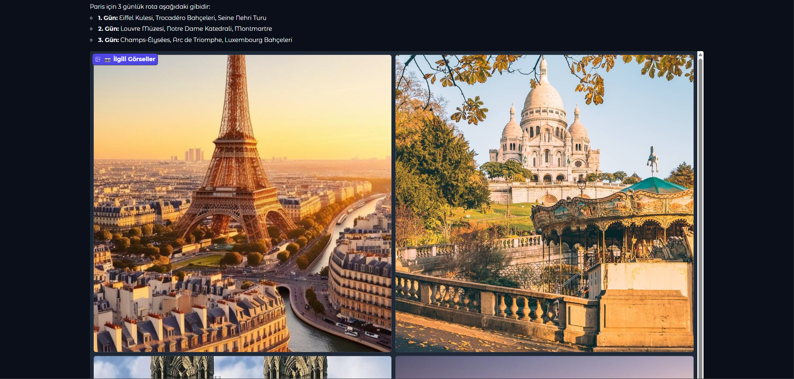
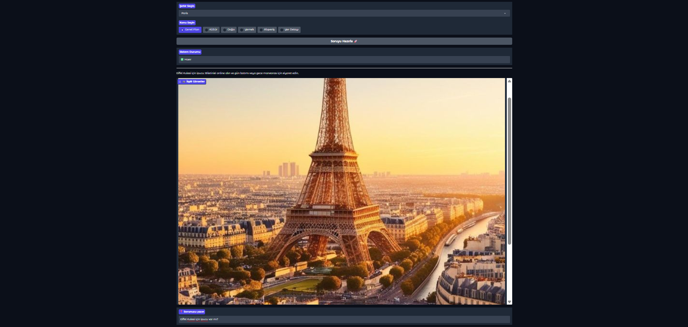

# 🗺️ Gelişmiş RAG Tabanlı Seyahat Asistanı (Gemini & ChromaDB)

Bu proje, Akbank GenAI Bootcamp'i için geliştirilmiş, coğrafi rota optimizasyonu özelliğine sahip, gelişmiş bir RAG (Retrieval-Augmented Generation) tabanlı seyahat asistanıdır.

## 🚀 Canlı Demo (Hugging Face)

Uygulamanın canlı çalışan versiyonuna aşağıdaki linkten ulaşabilirsiniz:

**[➡️ Buraya Tıklayarak Canlı Demoyu Deneyin](https://huggingface.co/spaces/fatmanurdemir/Chatbot-Travel_Assistant)**

---

## 🖥️ Örnek Kullanım & Product Kılavuzu

Projenin temel özelliklerini ve Uğurcan Bey'in geribildirimi üzerine eklenen rota optimizasyonunu gösteren bazı kullanım örnekleri aşağıdadır.

### 1. Rota Sorgusu ve Coğrafi Optimizasyon

Kullanıcı bir şehir için rota istediğinde, asistan önce LLM (Gemini) kullanarak bir plan oluşturur. Ardından, bu plandaki yerleri `travel_routes.json` dosyasındaki koordinatlara göre **en yakın komşu mantığıyla (coğrafi olarak) yeniden sıralayarak** kullanıcıya optimize edilmiş bir rota sunar.


*Görsel 1: Kullanıcının rota sorgusu.*


*Görsel 2: Asistanın ürettiği optimize edilmiş rota çıktısı.*

### 2. Spesifik Bilgi Sorgusu (RAG)

Kullanıcı "Eiffel Kulesi için ipucu var mı?" gibi spesifik bir soru sorduğunda, RAG mimarisi devreye girer. Asistan, ChromaDB vektör veritabanından sadece ilgili bilgiyi (context) bularak cevap üretir.


*Görsel 3: RAG ile spesifik bilgi sorgulama.*

---

## 🛠️ Teknik Altyapı ve Mimari

Proje, **LangChain kullanılmadan** manuel bir RAG pipeline'ı implemente edilerek oluşturulmuştur:

* **Dil Modeli (LLM):** `gemini-2.5-flash`
* **Embedding Modeli:** `sentence-transformers/all-MiniLM-L6-v2`
* **Vektör Veritabanı:** `ChromaDB`
* **Arayüz (UI):** `Gradio`
* **Hosting (Deployment):** `Hugging Face Spaces`
* **Özgün Özellik:** `generate_and_order_route` fonksiyonu ile en yakın komşu mantığına dayalı coğrafi rota optimizasyonu.

---

## 🎯 Proje Amacı

Bu projenin temel amacı, Büyük Dil Modellerinin (LLM) bilgiye dayalı, **kontrollü ve doğrulanabilir** yanıtlar üretme yeteneğini sergilemektir.

**Neden Seyahat Asistanı?**

Seyahat etmek benim için büyük bir tutku. Ancak yurt dışına çıktığımda, **etkili ve zaman/maliyet açısından optimize edilmiş seyahat rotaları** oluşturmanın ne kadar zor olduğunu bizzat deneyimledim. Farklı yerleri tek tek araştırmak, en yakın komşuluk mantığıyla sıralamak ve tüm bu bilgiyi tek bir akıcı planda birleştirmek **büyük bir zaman ve çaba gerektiriyor.**

Bu chatbot, tam da bu zorluğu aşmak için tasarlandı:

1.  **Semantik Arama (RAG):** Kullanıcı sorusunun anlamını vektörlere dönüştürerek, önceden yüklenmiş kapsamlı veri setimizden (`travel_routes.json`) en alakalı bilgiyi anında bulma.
2.  **Dinamik ve Optimize Rota Oluşturma:** LLM'den alınan planları, yerlerin coğrafi koordinatlarına göre **en yakın komşu mantığıyla optimize edilmiş sıraya** koyarak, kullanıcıya pratik ve zahmetsiz bir rota sunma.

---

## ⚙️ Yerel (Lokal) Kurulum Talimatları

Proje, Hugging Face Spaces üzerinden canlı olarak erişilebilir durumdadır. Ancak, kendi bilgisayarınızda (lokal) çalıştırmak isterseniz aşağıdaki adımları izleyebilirsiniz.

### 1. Ön Koşullar

* Python 3.x
* Git

### 2. Ortam Hazırlığı

1.  Proje dosyalarını klonlayın:
    ```bash
    git clone [BURAYA_BU_GITHUB_REPONUZUN_LINKINI_YAPISTIRIN]
    ```
2.  Komut Satırında (Terminal) proje ana dizinine gidin.
3.  Sanal Ortam Oluşturun (Önerilir):
    ```bash
    python -m venv venv
    ```
4.  Sanal Ortamı Aktif Edin:
    * Windows'ta: `.\venv\Scripts\activate`
    * MacOS/Linux'ta: `source venv/bin/activate`

### 3. API Anahtarının Tanımlanması

Proje ana dizininde `.env` adında bir dosya oluşturun ve içine Google Gemini API anahtarınızı ekleyin:

